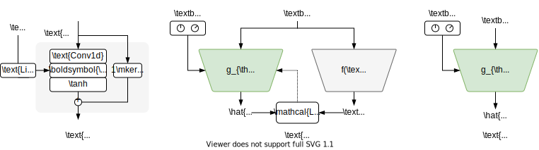

# Steerable discovery of neural audio effects 

[Christian J. Steinmetz](https://www.christiansteinmetz.com/)  and  [Joshua D. Reiss](http://www.eecs.qmul.ac.uk/~josh/)

| [Paper]() | [Colab](https://colab.research.google.com/github/csteinmetz1/steerable-nafx/blob/master/steerable-nafx.ipynb) | [Demo](https://csteinmetz1.github.io/steerable-nafx) | [Talk]() | [Slides]() |

## Abstract
Applications of deep learning for audio effects often focus on modeling analog effects or learning to control effects to emulate a trained audio engineer. 
However, deep learning approaches also have the potential to expand creativity through neural audio effects that enable new sound transformations. 
While recent work demonstrated that neural networks with random weights produce compelling audio effects, control of these effects is limited and unintuitive.
To address this, we introduce a method for the steerable discovery of neural audio effects.
This method enables the design of effects using example recordings provided by the user. 
We demonstrate how this method produces an effect similar to the target effect, along with interesting inaccuracies, while also providing perceptually relevant controls.